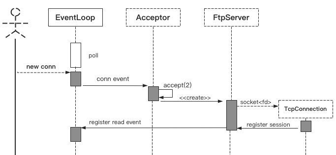

# miniftp


## Demo
[](https://user-images.githubusercontent.com/14357954/181453521-e470cf50-4a37-4b3d-afe8-cc08f7353eca.mp4)

## 介绍

一个 Rust 实现的 Linux Light FTP Server

## 支持的功能

- 大部分的 FTP 命令
- 支持主被动传输模式
- 支持用户自定义配置信息
- 支持指定被动模式下数据端口的范围，考虑到了主机配置有防火墙的情况
- 支持文件上传/下载的断点续传
- 支持限速功能，防止服务过多占用带宽资源
- 限流，防 DDOS 攻击
- 空闲连接自动剔除

## 快速运行此代码
## 可执行程序
下载 release 中的可执行程序包，解压，运行

### 源码编译

#### 环境依赖
1. Linux 主机
2. Cargo 编译器


#### 编译步骤

1. 在当前目录下，执行 `cargo build --release`，此时在`./target/release/` 生产可执行文件 `miniftp`
2. 按照需求设置配置文件 `config.yaml` 中的选项
3. 运行程序 `sudo ./target/release/miniftp -c config.yaml`
4. 若主机打开的有防火墙，请确保配置文件用到的端已在防火墙中打开
5. 客户端连接到此服务器，默认的端口是 8089
6. 示例：
 - 服务器端启动服务
 ```bash
 cargo build --release
 sudo ./target/release/miniftp -c config.yaml
 ```
 - 本地 FTP 客户端连接到服务器 若没有安装 ftp 客户端，可运行 sudo apt install -y ftp 安装ftp客户端
 ```bash
 > ftp
 > open 127.0.0.1 8089
 ```

## 项目结构

```
miniftp
|-- src
|  |-- handler          FTP 业务逻辑主体
|  |  |-- cmd           命令解析匹配及返回码宏定义
|  |  |-- codec         编码/解码器，解决粘包问题
|  |  |-- session       FTP 功能实现
|  |  |-- error         错误类型转换
|  |  \-- speed_barrier 速度控制类
|  |-- net              Reactor 模式实现
|  |  |-- acceptor      接收器，用于服务端接受连接
|  |  |-- socket        socket 文件符 wrapper 防止资源泄露
|  |  |-- connection    TCP 连接管理器
|  |  |-- buffer        缓存区，非阻塞 IO 必备，可动态扩容
|  |  |-- poller        IO multiplexing 的接口及实现
|  |  |-- event_loop    IO EventLoop，进行 IO event 分发
|  |  \-- sorted_list   排序链表，实现空闲踢出功能
|  |-- server           TCP server
|  |  |-- record_lock   文件锁管理
|  |  \-- server        FTP 服务端，任务管理
|  |-- threadpool       线程池
|  |   |-- queue        阻塞队列，线程通信使用
|  |   \-- threadpool   线程池实现，还需实现动态伸缩
|  \-- utils            helper 函数存放地
|      |-- config       服务文件配置
|      |-- macro_util   各类宏定义
|      \-- utils        守护进程设置及 logging 配置
|-- test
|-- main.rs
|-- README
|-- run.sh
|-- config.yaml
\-- Dockerfile
```

## 服务处理时序
  miniftp 是由 `epoll` 实现的 `Reactor` 的事件驱动框架下运行的 FTP Server。
  本部分介绍了基本的连接的建立和处理客户端请求的基本流程。
  minifp 新建连接的基本调用流程见图1。
  1. `Poller` 实现 `IO multiplexing` 功能，而 `EventLoop` 负责管理 `Poller`, miniftp 的主线程为一直循环的 `IO-Event Loop`；
  2. 一旦有一个新的连接事件，`EventLoop` 便会调用 `Acceptor` 对象创建 `Socket` 对象，`Socket` 创建 `TcpConnection`；
  3. 该TCP连接向 `EventLoop` 注册，并注册 `Session` 和 `EventLoop`。
  

  miniftp 处理命令的基本调用流程见图2。
  1. 一个连接注册成功后，client 向 server 发送命令，`EventLoop` 产生 `read event`;
  2. 在 `FtpServer` 找到对应的 `Session` 丢入 `ThreadPool` 中的线程；
  3. `Session` 在线程中调用 `TcpConnection` 处理 `read event`，之后从 `Buffer` 类读取数据，进行 `decode`；
  4. 将读取的命令解析为 `Command` 进行匹配 `Session` 对应的函数处理 FTP 命令；
  5. 处理完命令之后，假若需要进行数据传输，FTP 创建一个 `TcpConnection`，该 `TcpConnection` 在向 Client 发送完数据后断开;
  

## Reference
  1. [Advanced Programming in the UNIX Environmen](https://www.youtube.com/watch?v=3H7SQWTR6Dw)
  2. [The Linux Programming Interface](https://man7.org/tlpi/)
  3. [Linux多线程服务端编程](https://book.douban.com/subject/20471211/)
  4. [The Rust Programming Language](https://doc.rust-lang.org/book/)
